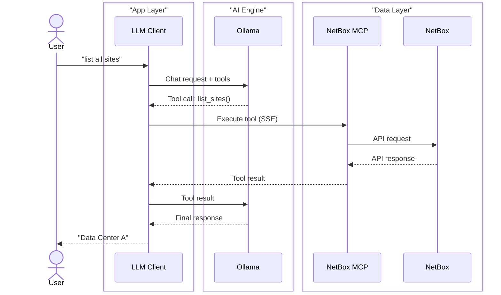

# Lab LLM NetOps

Lab environment untuk demonstrasi integrasi LLM dengan NetBox menggunakan Model Context Protocol (MCP).

## Apa itu?

### NetBox
[NetBox](https://netboxlabs.com/) adalah aplikasi open-source untuk dokumentasi dan manajemen infrastruktur jaringan. NetBox menyediakan model data untuk IP addresses, VLANs, racks, devices, circuits, dan lainnya via Web atau REST API.

### LLM (Large Language Model)
LLM adalah model AI yang dapat memahami dan menghasilkan teks natural language. Dalam project ini, kita menggunakan [Ollama](https://ollama.ai/) sebagai runtime untuk menjalankan model seperti `llama3.1` yang mendukung **tool calling** - kemampuan LLM untuk memanggil fungsi eksternal.

### MCP (Model Context Protocol)
[MCP](https://modelcontextprotocol.io/) adalah protokol standar yang dikembangkan oleh Anthropic untuk menghubungkan LLM dengan sumber data eksternal. MCP memungkinkan LLM mengakses tools dan resources secara terstruktur via transport seperti SSE (Server-Sent Events).

## Arsitektur



## Fitur

- **NetBox MCP Server**: Mengekspos data NetBox via protokol MCP (SSE transport)
- **LLM Client**: Interface chat menggunakan Ollama dengan dukungan tool calling
- **Tools yang tersedia**:
  - `list_sites` - Daftar semua sites
  - `list_devices` - Daftar semua devices
  - `get_device` - Detail device berdasarkan nama
  - `list_ip_addresses` - Daftar semua IP addresses
  - `get_ip_address` - Detail IP address
  - `list_prefixes` - Daftar semua prefix/subnet dengan info utilisasi
  - `get_prefix` - Detail prefix tertentu
  - `list_vlans` - Daftar semua VLANs
  - `generate_topology` - Data topologi lengkap untuk dokumentasi dan diagram

📄 **Lihat [Use Cases](docs/USE_CASES.md)** untuk contoh skenario dokumentasi jaringan.

## Prasyarat

- Docker & Docker Compose
- Ollama server dengan model `llama3.1` (atau model lain yang mendukung tool calling)

## Cara Memulai

1. **Clone dan konfigurasi**
   ```bash
   git clone <repo-url>
   cd lab_llmnetops
   cp .env.example .env
   ```

2. **Generate secret keys**
   Jalankan script `generate_secrets.sh` untuk menghasilkan secure keys:
   ```bash
   ./generate_secrets.sh
   ```
   Script ini akan menghasilkan:
   - `SECRET_KEY`
   - `FIELD_ENCRYPTION_KEY`
   - `API_TOKEN_PEPPER_1`
   
   Copy nilai yang dihasilkan ke dalam file `.env`.

3. **Edit konfigurasi**
   Edit `.env` dan sesuaikan variabel berikut:
   - `DB_PASSWORD` & `POSTGRES_PASSWORD` (harus sama)
   - `REDIS_PASSWORD`
   - `OLLAMA_HOST` (alamat server Ollama Anda)

4. **Jalankan services**
   ```bash
   docker compose up -d
   ```
   Tunggu hingga semua services berstatus `healthy` (cek dengan `docker compose ps`).

5. **Populate data sample** (opsional)
   Untuk menjalankan script `populate_netbox.py`, buat virtual environment dan install dependencies-nya terlebih dahulu:
   ```bash
   # Buat dan aktifkan venv
   python3 -m venv .venv
   source .venv/bin/activate

   # Install pynetbox
   pip install pynetbox

   # Jalankan script
   python netbox/scripts/populate_netbox.py
   ```

6. **Jalankan LLM Client**
   ```bash
   ./llm-client/run_client.sh
   ```

## Struktur Project

```
lab_llmnetops/
├── docker-compose.yml
├── .env                # Unified configuration
├── .env.example
├── llm-client/           # LLM chat client
│   ├── Dockerfile
│   ├── run_client.sh
│   └── src/client.py
├── netbox/               # Konfigurasi & data NetBox
│   ├── data/             # Persistent storage (gitignored)
│   └── scripts/          # Helper scripts
└── netbox-mcp/           # MCP server untuk NetBox
    ├── Dockerfile
    └── src/server.py
```

## Contoh Penggunaan

```
User: tampilkan semua IP address yang ada di netbox
Assistant: Berikut adalah daftar IP address yang ada di NetBox:
* 10.0.0.1/24 (Gateway Management)
* 172.16.0.10/24 (Web Server)
* 192.168.1.100/24 (Workstation-01)

User: get IP address 172.16.0.10
Assistant: IP 172.16.0.10/24 adalah "Web Server" dengan status Active.

User: buatkan dokumentasi jaringan untuk Data Center A
Assistant: Berikut adalah ringkasan jaringan untuk Data Center A:

**Prefixes:**
- 10.0.0.0/24 (Management Network)
- 172.16.0.0/24 (Server Network)
- 192.168.1.0/24 (User Network)

**Devices:**
- **Core Router**: core-rtr-01, core-rtr-02
- **Distribution Switch**: dist-sw-01, dist-sw-02
- **Access Switch**: access-sw-01, access-sw-02, access-sw-03
- **Firewall**: fw-perimeter-01, fw-internal-01

Total perangkat: 8
Total subnet: 3
```

## Lisensi

MIT
