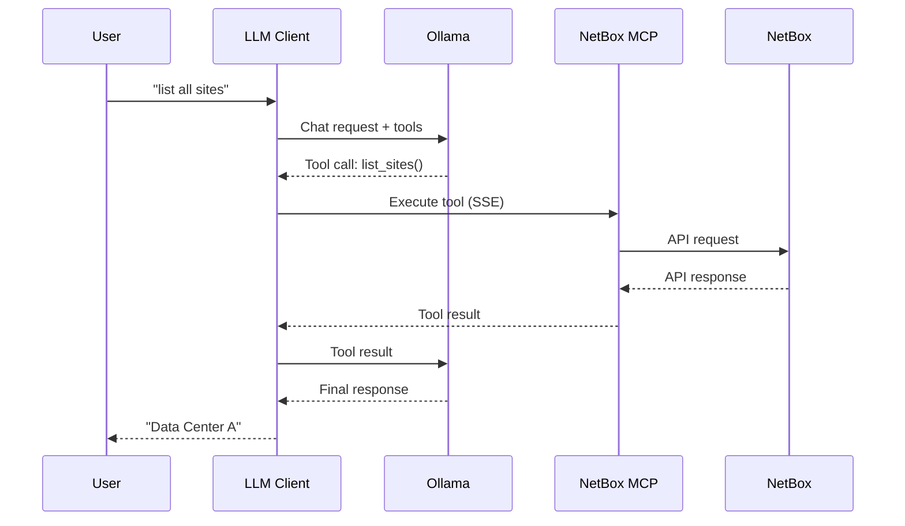

# Lab LLM NetOps

Lab environment untuk demonstrasi integrasi LLM dengan NetBox menggunakan Model Context Protocol (MCP).

## Apa itu?

### NetBox
[NetBox](https://netboxlabs.com/) adalah aplikasi open-source untuk dokumentasi dan manajemen infrastruktur jaringan. NetBox menyediakan model data untuk IP addresses, VLANs, racks, devices, circuits, dan lainnya via Web atau REST API.

### LLM (Large Language Model)
LLM adalah model AI yang dapat memahami dan menghasilkan teks natural language. Dalam project ini, kita menggunakan [Ollama](https://ollama.ai/) sebagai runtime untuk menjalankan model seperti `llama3.1` yang mendukung **tool calling** - kemampuan LLM untuk memanggil fungsi eksternal.

### MCP (Model Context Protocol)
[MCP](https://modelcontextprotocol.io/) adalah protokol standar yang dikembangkan oleh Anthropic untuk menghubungkan LLM dengan sumber data eksternal. MCP memungkinkan LLM mengakses tools dan resources secara terstruktur via transport seperti SSE (Server-Sent Events).

## Arsitektur



## Fitur

- **NetBox MCP Server**: Mengekspos data NetBox via protokol MCP (SSE transport)
- **LLM Client**: Interface chat menggunakan Ollama dengan dukungan tool calling
- **Tools yang tersedia**:
  - `list_sites` - Daftar semua sites
  - `get_device` - Detail device berdasarkan nama
  - `get_ip_address` - Detail IP address
  - `list_ip_addresses` - Daftar semua IP addresses

## Prasyarat

- Docker & Docker Compose
- Ollama server dengan model `llama3.1` (atau model lain yang mendukung tool calling)

## Cara Memulai

1. **Clone dan konfigurasi**
   ```bash
   git clone <repo-url>
   cd lab_llmnetops
   cp netbox/env/netbox.env.example netbox/env/netbox.env
   cp netbox/env/postgres.env.example netbox/env/postgres.env
   cp netbox/env/redis.env.example netbox/env/redis.env
   ```

2. **Generate secret keys**
   ```bash
   ./generate_secrets.sh
   ```
   Copy hasil output ke `netbox/env/netbox.env`.

3. **Edit konfigurasi**
   - Update `docker-compose.yml` dengan alamat Ollama server Anda
   - Sesuaikan password di env files sesuai kebutuhan

4. **Jalankan services**
   ```bash
   docker compose up -d
   ```

5. **Populate data sample** (opsional)
   ```bash
   python netbox/scripts/populate_netbox.py
   ```

6. **Jalankan LLM Client**
   ```bash
   cd llm-client && ./run_client.sh
   ```

## Struktur Project

```
lab_llmnetops/
├── docker-compose.yml
├── llm-client/           # LLM chat client
│   ├── Dockerfile
│   ├── run_client.sh
│   └── src/client.py
├── netbox/               # Konfigurasi & data NetBox
│   ├── env/              # Environment files
│   ├── data/             # Persistent storage (gitignored)
│   └── scripts/          # Helper scripts
└── netbox-mcp/           # MCP server untuk NetBox
    ├── Dockerfile
    └── src/server.py
```

## Konfigurasi

### Ollama Server
Update `OLLAMA_HOST` di `docker-compose.yml`:
```yaml
environment:
  - OLLAMA_HOST=http://alamat-ollama-anda:11434
  - MODEL_NAME=llama3.1
```

### NetBox Token
Generate token di NetBox Admin panel dan update di `docker-compose.yml`:
```yaml
environment:
  - NETBOX_TOKEN=token-anda-disini
```

## Contoh Penggunaan

```
User: tampilkan semua IP address yang ada di netbox
Assistant: Berikut adalah daftar IP address yang ada di NetBox:
* 10.0.0.1/24 (Gateway Management)
* 172.16.0.10/24 (Web Server)
* 192.168.1.100/24 (Workstation-01)

User: get IP address 172.16.0.10
Assistant: IP 172.16.0.10/24 adalah "Web Server" dengan status Active.
```

## Lisensi

MIT
