# Use Case: Network Documentation Generation

## Overview

This document describes how to use the LLM Client to generate network documentation based on data stored in NetBox. The LLM leverages **Model Context Protocol (MCP)** to query NetBox and produce structured reports.

---

## Use Case 1: Network Infrastructure Summary

**Prompt:**
```
buatkan ringkasan infrastruktur jaringan untuk Data Center A
```

**Expected Output:**
```markdown
# Ringkasan Infrastruktur Jaringan - Data Center A

## Sites
- Data Center A (dc-a) - Status: Active

## Devices (8 total)
| Device          | Type          | Role                  | Status |
|-----------------|---------------|-----------------------|--------|
| core-rtr-01     | CSR1000v      | Core Router           | Active |
| core-rtr-02     | CSR1000v      | Core Router           | Active |
| dist-sw-01      | Catalyst 9300 | Distribution Switch   | Active |
| dist-sw-02      | Catalyst 9300 | Distribution Switch   | Active |
| access-sw-01    | EX4300        | Access Switch         | Active |
| access-sw-02    | EX4300        | Access Switch         | Active |
| access-sw-03    | EX4300        | Access Switch         | Active |
| fw-perimeter-01 | ASA 5506-X    | Firewall              | Active |
| fw-internal-01  | ASA 5506-X    | Firewall              | Active |

## IP Address Allocation
- **Management Network** (10.0.0.0/24): 3 addresses allocated
- **Server Network** (172.16.0.0/24): 4 addresses allocated
- **User Network** (192.168.1.0/24): 3 addresses allocated
```

---

## Use Case 2: IP Address Inventory Report

**Prompt:**
```
buatkan laporan inventaris alamat IP
```

**Expected Output:**
```markdown
# Laporan Inventaris Alamat IP

## Management Network (10.0.0.0/24)
| IP Address  | Description          | Status |
|-------------|----------------------|--------|
| 10.0.0.1    | Gateway Management   | Active |
| 10.0.0.2    | Switch-01 Management | Active |
| 10.0.0.3    | Switch-02 Management | Active |

## Server Network (172.16.0.0/24)
| IP Address  | Description          | Status |
|-------------|----------------------|--------|
| 172.16.0.1  | Gateway Server       | Active |
| 172.16.0.10 | Web Server           | Active |
| 172.16.0.11 | Database Server      | Active |
| 172.16.0.12 | Application Server   | Active |

## User Network (192.168.1.0/24)
| IP Address   | Description          | Status |
|--------------|----------------------|--------|
| 192.168.1.1  | Gateway User Network | Active |
| 192.168.1.100| Workstation-01       | Active |
| 192.168.1.101| Workstation-02       | Active |

**Total: 10 IP Addresses**
```

---

## Use Case 3: Device Inventory by Role

**Prompt:**
```
tampilkan daftar perangkat berdasarkan perannya
```

**Expected Output:**
```markdown
# Inventaris Perangkat Berdasarkan Role

## Core Router (2 devices)
- core-rtr-01 (Cisco CSR1000v)
- core-rtr-02 (Cisco CSR1000v)

## Distribution Switch (2 devices)
- dist-sw-01 (Cisco Catalyst 9300)
- dist-sw-02 (Cisco Catalyst 9300)

## Access Switch (3 devices)
- access-sw-01 (Juniper EX4300)
- access-sw-02 (Juniper EX4300)
- access-sw-03 (Juniper EX4300)

## Firewall (2 devices)
- fw-perimeter-01 (Cisco ASA 5506-X)
- fw-internal-01 (Cisco ASA 5506-X)
```

---

## Use Case 4: Quick Status Check

**Prompt:**
```
cek status perangkat core-rtr-01
```

**Expected Output:**
```
Device: core-rtr-01
Type: Cisco CSR1000v
Role: Core Router
Site: Data Center A
Status: Active
```

---

## Use Case 5: Subnet Utilization Report

**Prompt:**
```
buatkan laporan utilisasi subnet
```

**Expected Output:**
```markdown
# Laporan Utilisasi Subnet

| Subnet           | Description        | Used | Available | Utilization |
|------------------|--------------------|------|-----------|-------------|
| 10.0.0.0/24      | Management Network | 3    | 251       | 1.2%        |
| 172.16.0.0/24    | Server Network     | 4    | 250       | 1.6%        |
| 192.168.1.0/24   | User Network       | 3    | 251       | 1.2%        |
```

---

## Use Case 6: Network Topology Diagram with Documentation

**Prompt:**
```
buatkan dokumentasi lengkap jaringan Data Center A beserta diagram topologi dan penjelasannya
```

**Expected Output:**
```markdown
# Dokumentasi Jaringan - Data Center A

## 1. Network Topology Diagram

```mermaid
graph TB
    subgraph Internet
        WAN[("☁️ Internet")]
    end
    
    subgraph Perimeter["🔒 Perimeter Zone"]
        FW1[fw-perimeter-01<br/>ASA 5506-X]
    end
    
    subgraph Core["🏢 Core Layer"]
        CR1[core-rtr-01<br/>CSR1000v]
        CR2[core-rtr-02<br/>CSR1000v]
    end
    
    subgraph Distribution["📡 Distribution Layer"]
        DS1[dist-sw-01<br/>Catalyst 9300]
        DS2[dist-sw-02<br/>Catalyst 9300]
    end
    
    subgraph Internal["🛡️ Internal Security"]
        FW2[fw-internal-01<br/>ASA 5506-X]
    end
    
    subgraph Access["💻 Access Layer"]
        AS1[access-sw-01<br/>EX4300]
        AS2[access-sw-02<br/>EX4300]
        AS3[access-sw-03<br/>EX4300]
    end
    
    subgraph Networks["🌐 Network Segments"]
        NET1["10.0.0.0/24<br/>Management"]
        NET2["172.16.0.0/24<br/>Servers"]
        NET3["192.168.1.0/24<br/>Users"]
    end
    
    WAN --> FW1
    FW1 --> CR1 & CR2
    CR1 <--> CR2
    CR1 --> DS1
    CR2 --> DS2
    DS1 <--> DS2
    DS1 --> FW2
    DS2 --> FW2
    FW2 --> AS1 & AS2 & AS3
    AS1 --> NET1
    AS2 --> NET2
    AS3 --> NET3
```



## 2. Penjelasan Arsitektur

### Layer Perimeter
- **fw-perimeter-01** (Cisco ASA 5506-X): Firewall utama yang memfilter traffic dari internet. Berfungsi sebagai first line of defense untuk melindungi jaringan internal.

### Layer Core
- **core-rtr-01** & **core-rtr-02** (Cisco CSR1000v): Router inti dengan konfigurasi redundant. Kedua router saling terhubung untuk high availability dan load balancing traffic antar segmen.

### Layer Distribution
- **dist-sw-01** & **dist-sw-02** (Cisco Catalyst 9300): Switch distribusi yang menghubungkan core layer dengan access layer. Dilengkapi dengan inter-VLAN routing dan QoS policies.

### Layer Internal Security
- **fw-internal-01** (Cisco ASA 5506-X): Firewall internal untuk micro-segmentation dan proteksi lateral movement antara zona server dan user.

### Layer Access
- **access-sw-01** (Juniper EX4300): Mengelola Management Network (VLAN 10)
- **access-sw-02** (Juniper EX4300): Mengelola Server Network (VLAN 20)
- **access-sw-03** (Juniper EX4300): Mengelola User Network (VLAN 30)

## 3. Network Segmentation

| VLAN | Subnet           | Description        | Gateway      | Purpose                    |
|------|------------------|--------------------|--------------|----------------------------|
| 10   | 10.0.0.0/24      | Management Network | 10.0.0.1     | Network device management  |
| 20   | 172.16.0.0/24    | Server Network     | 172.16.0.1   | Production servers         |
| 30   | 192.168.1.0/24   | User Network       | 192.168.1.1  | End-user workstations      |

## 4. Device Inventory Summary

| Role                | Count | Vendor  | Model         |
|---------------------|-------|---------|---------------|
| Core Router         | 2     | Cisco   | CSR1000v      |
| Distribution Switch | 2     | Cisco   | Catalyst 9300 |
| Access Switch       | 3     | Juniper | EX4300        |
| Firewall            | 2     | Cisco   | ASA 5506-X    |
| **Total**           | **9** |         |               |

## 5. Rekomendasi

1. **High Availability**: Core routers sudah redundant, pertimbangkan untuk menambah redundansi pada firewall perimeter.
2. **Monitoring**: Implementasikan SNMP monitoring pada semua perangkat via Management Network.
3. **Backup**: Pastikan konfigurasi semua perangkat di-backup secara berkala.
```

---

## Notes

- The LLM uses **tool calling** to fetch data from NetBox via MCP.
- Responses are formatted in Bahasa Indonesia by default.
- You can request output in markdown, table, or plain text format.
- Mermaid diagrams can be rendered in any markdown viewer that supports it (GitHub, GitLab, VS Code, etc.)

